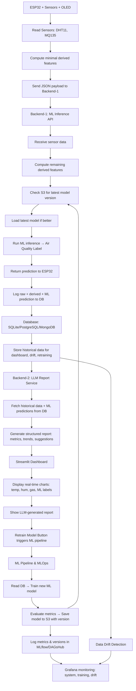

```mermaid
flowchart TD
    %% Edge Layer
    A[ESP32 + Sensors + OLED]
    A1[Read Sensors: DHT11, MQ135]
    A2[Compute minimal derived features ]
    A3[Send JSON payload to Backend-1]
    A --> A1 --> A2 --> A3

    %% Backend-1: ML Inference
    B[Backend-1: ML Inference API]
    B1[Receive sensor data]
    B2[Compute remaining derived features]
    B3[Check S3 for latest model version]
    B4[Load latest model if better]
    B5[Run ML inference → Air Quality Label]
    B6[Return prediction to ESP32]
    B7[Log raw + derived + ML prediction to DB]
    A3 --> B
    B --> B1 --> B2 --> B3 --> B4 --> B5 --> B6 --> B7

    %% Database Layer
    C[Database: SQLite/PostgreSQL/MongoDB]
    B7 --> C
    C1[Store historical data for dashboard, drift, retraining]
    C --> C1

    %% LLM Report Service
    D[Backend-2: LLM Report Service]
    D1[Fetch historical data + ML predictions from DB]
    D2[Generate structured report: metrics, trends, suggestions]
    C1 --> D
    D --> D1 --> D2

    %% Streamlit Dashboard
    E[Streamlit Dashboard]
    E1[Display real-time charts: temp, hum, gas, ML labels]
    E2[Show LLM-generated report]
    E3[Retrain Model Button triggers ML pipeline]
    D2 --> E
    E --> E1 --> E2 --> E3

    %% ML Pipeline & MLOps
    F[ML Pipeline & MLOps]
    F1[Read DB → Train new ML model]
    F2[Evaluate metrics → Save model to S3 with version]
    F3[Log metrics & versions in MLflow/DAGsHub]
    F4[Grafana monitoring: system, training, drift]
    E3 --> F
    F --> F1 --> F2 --> F3 --> F4
    F2 --> B3

    %% Optional Data Drift Simulation
    G[Data Drift Detection]
    C1 --> G
    G --> F4
```
