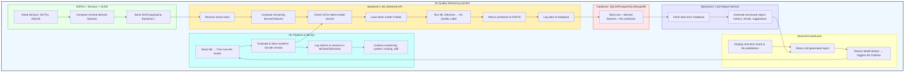

```mermaid
flowchart TD
    subgraph SYSTEM["Air Quality Monitoring System"]
        style SYSTEM fill:#f0f8ff,stroke:#333,stroke-width:2px

        %% Edge Device Layer
        subgraph EDGE["ESP32 + Sensors + OLED"]
            style EDGE fill:#e6ffe6,stroke:#2f8f2f,stroke-width:1px
            A1[Read Sensors: DHT11, MQ135]
            A2[Compute minimal derived features ]
            A3[Send JSON payload to Backend-1]
            A1 --> A2 --> A3
        end

        %% Backend-1 Layer
        subgraph BACKEND["Backend-1: ML Inference API"]
            style BACKEND fill:#fff0b3,stroke:#ff9900,stroke-width:1px
            B1[Receive sensor data]
            B2[Compute remaining derived features]
            B3[Check S3 for latest model version]
            B4[Load latest model if better]
            B5[Run ML inference → Air Quality Label]
            B6[Return prediction to ESP32]
            B7[Log data to Database]
            B1 --> B2 --> B3 --> B4 --> B5 --> B6 --> B7
        end

        %% Database Layer
        subgraph DB["Database: SQLite/PostgreSQL/MongoDB"]
            style DB fill:#ffe6e6,stroke:#cc0000,stroke-width:1px
            C1[Store raw + derived features + ML prediction]
        end

        %% LLM Layer
        subgraph LLM["Backend-2: LLM Report Service"]
            style LLM fill:#e6e6ff,stroke:#3333cc,stroke-width:1px
            D1[Fetch data from Database]
            D2[Generate structured report: metrics, trends, suggestions]
            D1 --> D2
        end

        %% Dashboard Layer
        subgraph DASH["Streamlit Dashboard"]
            style DASH fill:#ffffcc,stroke:#cccc00,stroke-width:1px
            E1[Display real-time charts & ML predictions]
            E2[Show LLM-generated report]
            E3[Retrain Model Button → triggers ML Pipeline]
            E1 --> E2 --> E3
        end

        %% ML Pipeline & MLOps Layer
        subgraph MLOPS["ML Pipeline & MLOps"]
            style MLOPS fill:#ccfffb,stroke:#009999,stroke-width:1px
            F1[Read DB → Train new ML model]
            F2[Evaluate & Save model to S3 with version]
            F3[Log metrics & versions in MLflow/DAGsHub]
            F4[Grafana monitoring: system, training, drift]
            F1 --> F2 --> F3 --> F4
        end

        %% Connections between boxes
        A3 --> B1
        B7 --> C1
        C1 --> D1
        D2 --> E2
        E3 --> F1
        F2 --> B3
    end
```

