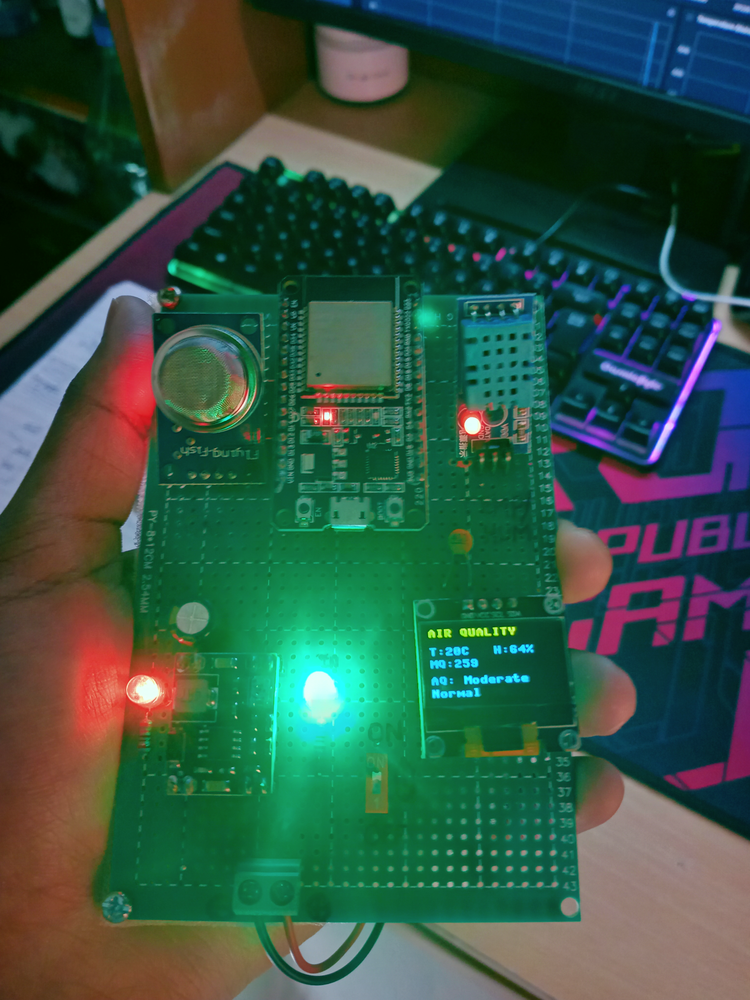
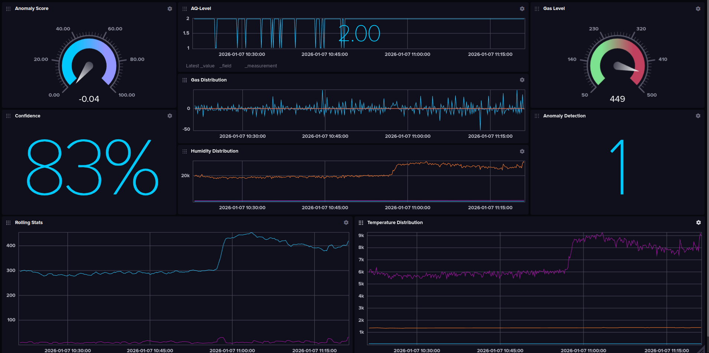
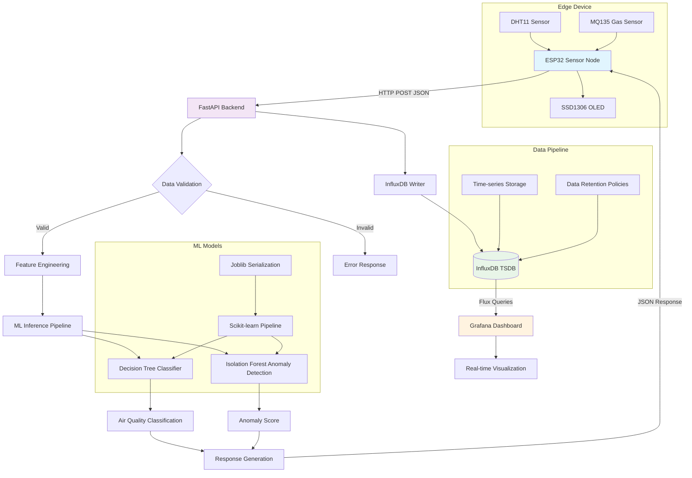

# Air Quality Monitor

Distributed IoT environmental monitoring system implementing real-time air quality assessment through multi-sensor fusion, machine learning inference, and time-series analytics on ESP32-based edge nodes.

<div align="center">
  
  
  <br>
  <em>Complete sensor node assembly with ESP32, environmental sensors, OLED display showing real-time air quality readings</em>
</div>

## Overview

The Air Quality Monitor (AOQ) represents a comprehensive IoT solution for environmental monitoring, combining embedded systems engineering, machine learning, and distributed computing principles. This system demonstrates the integration of edge computing with cloud-based analytics, implementing a complete data pipeline from sensor acquisition to visualization.

The project showcases several advanced concepts:
- **Edge AI Implementation**: Real-time machine learning inference on resource-constrained microcontrollers
- **Multi-sensor Fusion**: Combining temperature, humidity, and gas sensor data for comprehensive environmental assessment
- **Time-series Analytics**: Leveraging InfluxDB's columnar storage and Flux query language for efficient temporal data processing
- **Microservice Architecture**: Containerized services with FastAPI providing RESTful interfaces
- **Real-time Visualization**: Grafana dashboards with sub-second update intervals for monitoring environmental trends

The system operates on a distributed architecture where ESP32-based sensor nodes perform local data acquisition and preprocessing, while a centralized backend handles machine learning inference, data persistence, and visualization. This approach minimizes network overhead while maintaining real-time responsiveness and scalability.

## Dashboard Screenshots

### InfluxDB Time-Series Database

*InfluxDB data explorer showing real-time sensor telemetry and ML inference results*

### Grafana Real-time Dashboard

*Grafana visualization with time-series plots, anomaly detection alerts, and air quality trends*

## System Architecture

### Hardware Layer
- **MCU**: ESP32-WROOM-32 (Xtensa LX6 dual-core @ 240MHz, 520KB SRAM)
- **Environmental Sensors**: DHT11 (±2°C, ±5% RH accuracy), MQ135 (NH3, NOx, CO2 detection)
- **Display**: SSD1306 OLED (128×64, I2C interface)
- **Connectivity**: IEEE 802.11 b/g/n Wi-Fi, HTTP/JSON protocol

### Software Stack
- **Firmware**: MicroPython 1.20+ with asyncio event loop
- **Backend**: FastAPI (ASGI) with Pydantic data validation
- **ML Pipeline**: Scikit-learn ensemble methods (Decision Tree + Isolation Forest)
- **TSDB**: InfluxDB 2.x with Flux query language
- **Visualization**: Grafana with real-time dashboards

### System Workflow



## Quick Start

### Docker Setup
```bash
# Clone and navigate
git clone <repository-url>
cd AOQ

# Configure environment
cp .env.example .env
# Edit .env with your settings

# Start services
docker-compose up -d
```

### Manual Setup
```bash
# Install dependencies
pip install -r requirements.txt

# Train models
python scripts/train_model.py

# Start backend
uvicorn backend.app:app --host 0.0.0.0 --port 8000
```

## Hardware Implementation

### Component Specifications
- **ESP32-WROOM-32**: 32-bit MCU, 4MB Flash, 520KB SRAM
- **DHT11**: Digital temperature/humidity sensor (3.3V, single-wire protocol)
- **MQ135**: Analog gas sensor (NH3, NOx, alcohol, benzene, smoke, CO2)
- **SSD1306**: 128×64 monochrome OLED (I2C, 3.3V)

### Pin Configuration
```
DHT11  → GPIO 4  (Digital I/O, 1-wire protocol)
MQ135  → GPIO 34 (ADC1_CH6, 12-bit resolution, 0-4095 range)
OLED   → I2C Bus (SDA: GPIO 21, SCL: GPIO 22, 400kHz)
Power  → 3.3V/GND rails
```

**MQ135 Characteristics**:
- Heating voltage: 5V ±0.1V
- Detection range: 10-300ppm (NH3), 10-1000ppm (NOx)
- Response time: <30s
- ADC mapping: Raw ADC → ppm conversion via lookup table

### Firmware Deployment

```bash
# Install MicroPython toolchain
pip install mpremote esptool

# Flash MicroPython firmware (if needed)
esptool.py --chip esp32 --port /dev/ttyUSB0 erase_flash
esptool.py --chip esp32 --port /dev/ttyUSB0 write_flash -z 0x1000 esp32-*.bin

# Deploy application code
mpremote connect /dev/ttyUSB0 fs cp firmware/boot.py :
mpremote connect /dev/ttyUSB0 fs cp firmware/main.py :
mpremote connect /dev/ttyUSB0 fs cp firmware/ssd1306.py :

# Monitor serial output
mpremote connect /dev/ttyUSB0 repl
```


## API Specification

### POST /infer
Executes ML inference pipeline on sensor telemetry data.

**Request Schema** (Pydantic validation):
```json
{
  "temp": 25.5,    // Temperature (°C, float, -40 to 80)
  "hum": 60.0,     // Relative humidity (%, float, 0-100)
  "mq": 512        // MQ135 ADC reading (int, 0-4095)
}
```

**Response Schema**:
```json
{
  "temp": 25.5,
  "hum": 60.0,
  "aq_label": "Good",     // Classification result
  "anomaly": false        // Isolation Forest detection
}
```

**Processing Pipeline**:
1. Feature engineering (temp/hum normalization, MQ135 scaling)
2. Decision Tree classification (4-class AQ levels)
3. Isolation Forest anomaly detection (contamination=0.1)
4. InfluxDB time-series insertion
5. JSON response serialization

## Air Quality Classification

### ML Model Architecture
- **Algorithm**: Decision Tree Classifier (Gini impurity, max_depth=10)
- **Features**: [temperature, humidity, mq135_normalized, temp_hum_ratio]
- **Training**: 80/20 split, cross-validation (k=5)
- **Anomaly Detection**: Isolation Forest (n_estimators=100)


## Services

- **Backend**: http://localhost:8000
- **Grafana**: http://localhost:3000
- **InfluxDB**: http://localhost:8086

## Project Structure

```
AOQ/
├── backend/          # FastAPI application
├── firmware/         # ESP32 MicroPython code
├── hardware/         # KiCad schematics and images
├── scripts/          # ML training and data processing
├── dashboard/        # Grafana configuration
├── dataset/          # Training data
└── tests/            # Test notebooks
```

## Development Workflow

### ML Pipeline Training
```bash
# Feature engineering and model training
python scripts/train_model.py
# Outputs: aq_classifier_tree.joblib, anomaly_model.joblib, scaler.joblib

# Model evaluation and visualization
python scripts/data_vis.py
# Generates: decision tree plots, feature importance, confusion matrix
```

### System Integration Testing
```bash
# End-to-end API testing
python test.py

# Load testing with concurrent requests
# Performance benchmarking: ~50ms inference latency
```


## Technical Specifications

- **Sampling Rate**: 0.2 Hz (5-second intervals)
- **Power Consumption**: ~150mA @ 3.3V (active), ~10µA (deep sleep)
- **Communication**: HTTP/1.1, JSON payload (~100 bytes)
- **Data Retention**: InfluxDB with configurable retention policies
- **Inference Latency**: <50ms (local ML models)
- **Operating Range**: -10°C to 50°C, 10-90% RH

